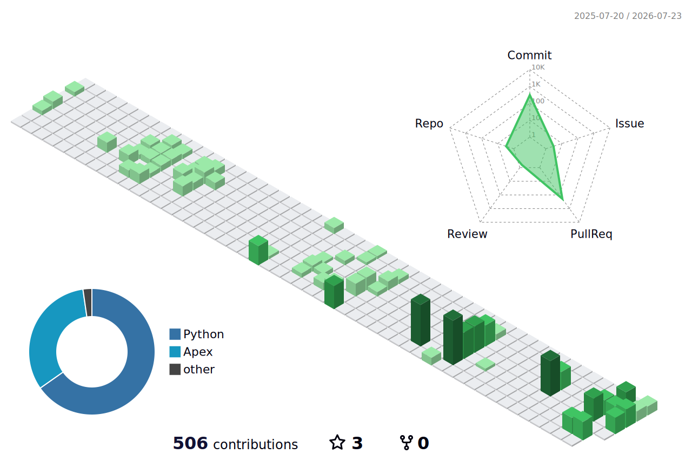

<h1 align="left">Hey 👋 What's up?</h1>

###

My name is Jordan Parra and I'm a ☁️ Salesforce Developer, from Colombia ☕🇨🇴

  
  

###

<h2 align="left">About me</h2>

###

<ul align="left">
  <li>✨ Creating bugs since 2018 — Apex, design patterns, JavaScript, integrations &amp; coding best practices.</li>
  <li>📚 Currently leveling up in Python, always exploring new languages and advanced Salesforce development.</li>
  <li>🎯 Goal: become a better developer (and person) every day.</li>
  <li>🏊‍♂️ Off the keyboard: swimmer and sports fan.</li>
</ul>

###

<h2 align="left">I code with</h2>

###

  
  
  
  
  
  
  
  
  
  
  
  
  

###

<h2 align="left">🔥 My stats</h2>

  
  

###

<h2 align="left">🌳 My 3D Contributions</h2>

###

  

###
